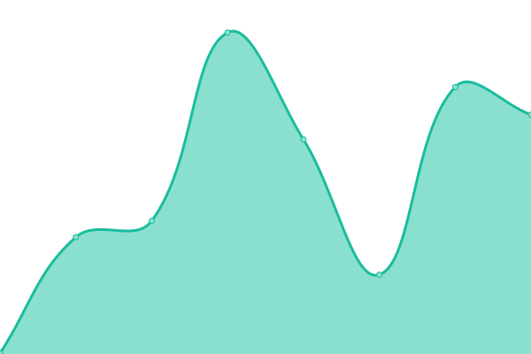

# [📈 Live Status](https://status.ocean-hosting.top): <!--live status--> **🟧 Partial outage**

This repository contains the open-source uptime monitor and status page for [Ocean Hosting](https://status.ocean-hosting.top), powered by [Upptime](https://github.com/upptime/upptime).

With [Upptime](https://upptime.js.org), you can get your own unlimited and free uptime monitor and status page, powered entirely by a GitHub repository. We use [Issues](https://github.com/Ocean-Hosting/ocean-upptime/issues) as incident reports, [Actions](https://github.com/Ocean-Hosting/ocean-upptime/actions) as uptime monitors, and [Pages](https://status.ocean-hosting.top) for the status page.

<!--start: status pages-->
<!-- This summary is generated by Upptime (https://github.com/upptime/upptime) -->
<!-- Do not edit this manually, your changes will be overwritten -->
<!-- prettier-ignore -->
| URL | Status | History | Response Time | Uptime |
| --- | ------ | ------- | ------------- | ------ |
|  [Ocean Hosting Main Website](https://ocean-hosting.top) | 🟩 Up | [ocean-hosting-main-website.yml](https://github.com/Ocean-Hosting/ocean-upptime/commits/HEAD/history/ocean-hosting-main-website.yml) | 

 375ms
     
 | 

<a href="https://status.ocean-hosting.top/history/ocean-hosting-main-website">100.00%</a>
    

|  [Ocean Hosting Client](https://client.ocean-hosting.top) | 🟥 Down | [ocean-hosting-client.yml](https://github.com/Ocean-Hosting/ocean-upptime/commits/HEAD/history/ocean-hosting-client.yml) | 

 0ms
     
 | 

<a href="https://status.ocean-hosting.top/history/ocean-hosting-client">0.00%</a>
    

|  [Ocean Hosting Panel](https://panel.ocean-hosting.top) | 🟥 Down | [ocean-hosting-panel.yml](https://github.com/Ocean-Hosting/ocean-upptime/commits/HEAD/history/ocean-hosting-panel.yml) | 

 0ms
     
 | 

<a href="https://status.ocean-hosting.top/history/ocean-hosting-panel">0.00%</a>
    

|  [Germany 1](https://de1.ocean-hosting.top:8080) | 🟥 Down | [germany-1.yml](https://github.com/Ocean-Hosting/ocean-upptime/commits/HEAD/history/germany-1.yml) | 

 0ms
     
 | 

<a href="https://status.ocean-hosting.top/history/germany-1">0.00%</a>
    

<!--end: status pages-->

[**Visit our status website →**](https://status.ocean-hosting.top)

## 📄 License

- Powered by: [Upptime](https://github.com/upptime/upptime)
- Code: [MIT](./LICENSE) © [Anand Chowdhary](https://anandchowdhary.com), supported by [Pabio](https://pabio.com)
- Data in the `./history` directory: [Open Database License](https://opendatacommons.org/licenses/odbl/1-0/)
